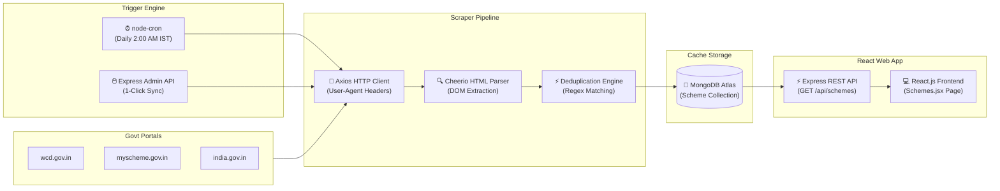

# SheFinance - Women Financial Inclusion Website 

**SheFinance** is a comprehensive, AI-powered web platform designed to empower women across India through financial literacy, automated income/expense tracking, intelligent budget planning, machine-learning analytics, and **live government scheme discovery powered by an automated web scraper engine**.

---

## 📌 1. Executive Summary & Problem Definition

In India, a significant gender gap exists in financial literacy and independence. Despite increasing workforce participation, many women—including students, homemakers, working professionals, and micro-entrepreneurs—lack access to simple, centralized financial planning tools and awareness of government welfare schemes. Financial information remains scattered across complex government websites, making it difficult to search, understand, and apply.

**SheFinance** solves this by offering a unified, secure platform featuring:
* 🏛️ **Live Government Schemes Directory**: Scraped live from official portals (`wcd.gov.in`, `myscheme.gov.in`, `india.gov.in`) with automated daily background sync via `node-cron` and MongoDB Atlas caching.
* 🤖 **AI Financial Assistant & NLP Chatbot**: Supervised Machine Learning chatbot (`Scikit-Learn` TF-IDF + Multinomial Naive Bayes) customized for women's financial advice.
* 📊 **Smart Money Management**: Income & Expense Tracker, Savings Goals Progress Visualizer, Monthly Budget Planner (50-30-20 Rule), and Reports with charts.
* 🎓 **Financial Education Hub**: Categorized financial literacy modules, interactive Loan EMI & SIP Calculators, and Admin-published guides.
* 🛡️ **Admin Panel CMS & Management**: 1-Click Live Scheme Sync, User Management, Transaction & Savings Goal Monitor, Support Desk, and Content Publishing.

---

## 🛠️ 2. Technology Stack & System Architecture

### 🎨 Frontend
* **Framework**: React.js (Vite)
* **Styling**: Vanilla CSS3 (Modern Glassmorphic Responsive Aesthetics, Custom Tokens, Gradient Themes)
* **Icons & Assets**: FontAwesome 6, Lucide Icons, UI Avatars API
* **Navigation**: React Router DOM (Single Page Application architecture)

### ⚙️ Backend & APIs
* **Primary API Server**: Node.js & Express.js (`server.js` on Port 3000)
* **Machine Learning Server**: Python Flask ML Engine (`app.py` on Port 5000)
* **Database**: MongoDB Atlas (`mongoose` ODM)
* **Automation**: `node-cron` (Daily 2:00 AM IST background auto-sync)
* **Web Scraper Engine**: `cheerio` + `axios` (Automated server-side DOM scraping and data extraction)
* **Authentication**: JWT (JSON Web Tokens), bcryptjs password hashing, Google OAuth 2.0 integration

---

## 🕷️ 3. Web Scraper & Government Schemes Engine



### 🛠️ Scraper Technology Stack Map:

| Pipeline Stage | Technology / Module | Purpose |
| :--- | :--- | :--- |
| **HTTP Transport** | `axios` | Sends HTTPS requests with browser `User-Agent` headers & timeouts |
| **DOM Parsing** | `cheerio` | Server-side HTML query parsing & selector extraction |
| **Task Automation** | `node-cron` | Schedules background auto-sync every 24h at 2:00 AM IST |
| **High-Speed Cache** | MongoDB Atlas (`mongoose`) | Stores scraped data for < 50ms fast page delivery |
| **API Backend** | Express.js (`routes/schemes.js`) | Exposes `/api/schemes` & `/api/admin/schemes/sync` |
| **User Interface** | React.js (`Schemes.jsx`) | Renders interactive scheme cards with search & category filters |

### Key Scraper Features:
1. **Live Scraping**: Fetches live scheme listings directly from official portals like the **Ministry of Women & Child Development (`wcd.gov.in`)**.
2. **Deduplication**: Case-insensitive Regex title matching ensures zero duplicate records in MongoDB.
3. **High-Speed MongoDB Caching**: Serves scheme listings in **< 50ms**, ensuring the website operates smoothly even if government portals are slow or down.
4. **Fallback Seed Data**: Contains 12 curated baseline government schemes (*Sukanya Samriddhi Yojana*, *Mahila Samman Savings Certificate*, *PMMY Mudra Loan*, *Stand-Up India*, etc.).
5. **Admin 1-Click Sync**: Admins can manually trigger instant scraping from the Admin CMS (`POST /api/admin/schemes/sync`).

---

## 🤖 4. AI Chatbot & Machine Learning Pipeline

SheFinance incorporates two specialized Machine Learning engines in Python (`app.py`):

1. **Supervised NLP Financial Chatbot**:
   * **Feature Extraction**: TF-IDF Vectorization (`ngram_range=(1, 2)`).
   * **Classifier**: Multinomial Naive Bayes intent classification across 11 financial categories.
   * **Confidence Fallback**: Cosine similarity verification for ambiguous inputs.
   * **Persona Customization**: Tailors answers dynamically for Students, Homemakers, Working Professionals, and Entrepreneurs.

2. **Savings Timeline & Health Prediction Models**:
   * **`POST /api/predict_timeline`**: Predicts target goal achievement timeline using monthly savings rate and interest growth models.
   * **`POST /api/predict_health`**: Calculates a comprehensive Financial Health Score (0-100) based on age, income, spending ratios, and emergency reserves.

---

## 📁 5. Directory Structure

```text
├── client/                     # React Frontend Application (Vite)
│   ├── public/                 # Static assets & SVG icons
│   ├── src/
│   │   ├── api.js              # Centralized Axios API Service
│   │   ├── App.jsx             # React Router Configuration & Protected Routes
│   │   ├── index.css           # Global Styling & Design Tokens
│   │   ├── components/         # Reusable Components (DashboardNav, Navbar, Footer)
│   │   ├── data/               # Financial Literacy Data (educationData.js)
│   │   └── pages/              # 15 React Page Components
│   │       ├── Admin.jsx       # Admin Panel & CMS Management
│   │       ├── Budget.jsx      # Monthly Budget Planner (50-30-20 Rule)
│   │       ├── Chatbot.jsx     # AI Financial Assistant
│   │       ├── Dashboard.jsx   # Overview Dashboard & Quick Metrics
│   │       ├── Education.jsx   # Financial Literacy Hub & Calculators
│   │       ├── Home.jsx        # Landing Page
│   │       ├── Login.jsx       # User & Admin Login
│   │       ├── Onboarding.jsx  # New User Profile Setup
│   │       ├── Profile.jsx     # User Profile & Security Settings
│   │       ├── Register.jsx    # User Registration
│   │       ├── Reports.jsx     # Financial Analytics & Spend Breakdown
│   │       ├── Savings.jsx     # Savings Goals Progress Tracker
│   │       ├── Schemes.jsx     # Live Govt Schemes Directory & Filters
│   │       ├── Support.jsx     # Helpdesk & Ticket Submission
│   │       └── Tracker.jsx     # Income & Expense Transaction Logger
├── middleware/                 # Auth Protection & Admin-Only Middlewares
├── models/                     # Mongoose Schemas (User, Scheme, Transaction, Goal, Budget, Ticket, Cms)
├── routes/                     # Express API Route Handlers
│   ├── admin.js                # Admin Stats, User Management, CMS & Sync API
│   ├── auth.js                 # Authentication & Google OAuth
│   ├── budget.js               # Budget Planner CRUD
│   ├── chatbot.js              # Express Chatbot Proxy
│   ├── ml.js                   # ML Predictions Proxy
│   ├── profile.js              # User Profile Management
│   ├── savings.js              # Savings Goals CRUD
│   ├── schemes.js              # Public Schemes & Web Scraper Engine
│   ├── support.js              # Support Ticket System
│   └── transactions.js         # Income & Expense Transactions CRUD
├── app.py                      # Python Flask Machine Learning API
├── db.js                       # MongoDB Atlas Connection Setup
├── server.js                   # Node.js Express Backend & node-cron Setup
└── verify-all.js               # Automated 17-Point System Verification Suite
```

---

## 🧪 6. Testing & System Verification

The repository includes a comprehensive, automated system verification test suite (`verify-all.js`).

To run the verification suite:
```bash
node verify-all.js
```

### Test Suite Summary (17/17 Passed):
```text
========================================================
   FULL SYSTEM & PAGE VERIFICATION SUITE
========================================================

[PASS] ✅  1. API Health Check
[PASS] ✅  2. User Register & Login Flow
[PASS] ✅  3. Profile Get & Update
[PASS] ✅  4. Tracker CRUD & Summary
[PASS] ✅  5. Savings Goals CRUD
[PASS] ✅  6. Budget Planner Save & Load
[PASS] ✅  7. ML Timeline & Health Benchmark
[PASS] ✅  8. AI Chatbot Financial Engine
[PASS] ✅  9. Support Desk Ticket Submission
[PASS] ✅  10. Admin Authentication (admin@shefinance.com)
[PASS] ✅  11. Admin Platform Stats & Metrics
[PASS] ✅  12. Admin Users Directory
[PASS] ✅  13. Admin Transactions Monitor
[PASS] ✅  14. Admin Savings Goals Monitor
[PASS] ✅  15. Admin Support Ticket Management
[PASS] ✅  16. Admin Schemes Content Management (CMS)
[PASS] ✅  17. Admin Financial Literacy Articles (CMS)

========================================================
   TOTAL CHECKS: 17 | PASSED: 17 | FAILED: 0
   OVERALL STATUS: ALL SYSTEMS OPERATIONAL ✅🎉
========================================================
```

---

## 💻 7. Installation & Local Setup

### Prerequisites
- **Node.js**: v18.0.0 or higher
- **MongoDB**: MongoDB Atlas URI (configured in `.env`)
- **Python**: v3.9 or higher (for `app.py`)

### 1. Install Dependencies
```bash
# Root dependencies
npm install

# Client dependencies
npm install --prefix client
```

### 2. Configure Environment Variables (`.env`)
Create a `.env` file in the root directory:
```env
PORT=3000
MONGODB_URI=mongodb+srv://<username>:<password>@cluster.mongodb.net/shefinance?retryWrites=true&w=majority
JWT_SECRET=your_jwt_secret_key_here
```

### 3. Run the Servers
```bash
# Start Backend Express Server (Port 3000)
node server.js

# Start Frontend Dev Server (Port 5173)
npm run dev

# Start Python ML Server (Optional, Port 5000)
python app.py
```

---

## 🔑 Demo Admin Credentials

- **Admin Login Page**: [http://localhost:5173/login](http://localhost:5173/login)
- **Admin Email**: `admin@shefinance.com`
- **Admin Password**: `Admin@2026`

---

**Developed by:** Aemi Patel  
**Subject:** Project-I CEUP301 (Semester V)
